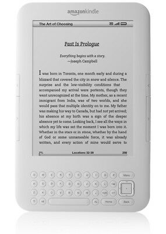

# Fixing a 2nd Generation Kindle
Documentation for fixing network issues on a 2nd gen Kindle

Despite the technical advancements of the latest E-Readers, I still hold on to my beloved 2nd generation 3G kindle - it's a wonderful device (sturdy, 4 weeks of battery, free international 3G for life, still has buttons!) and worked just fine... until this week. 

The other day, I connected to the Kindle store, bought a couple books, and went to sync them since they hadn't appeared in a few minutes like they usually would. When I clicked *Sync and Check for items*, I got the message: **"Your Kindle is unable to connect at this time. Please try again later. If the problem persists, please restart your Kindle from the Menu in Settings and try again"**. Restarts, factory resets, firmware and Kindle Services updates, etc. did not solve the problem. After two hours on the phone with support, they determined that "this problem cannot be solved through troubleshooting, unfortunately the device is out of warranty and must be replaced", and offered a small discount on a new one.

*Note - this can also manifest itself as the kindle returning the message "The Kindle store is currently unavailable. Please try again later." - the root cause is the same (a time/certificate issue) and the manifestation depends on your OS version.* 

Given that the storefront still worked, I knew it wasn't a total hardware failure, and thought there must be a solution, which I am publishing here for others. This may not work for you, and you're doing this at your own risk. That said, if you're encountering this issue, there's no other real way to solve it, and Amazon support doesn't have much incentive to develop a fix as not doing so will encourage people to buy new devices.

## Introduction

I have a Kindle 2nd Generation (B003... barcode, k2i international 3G), software version 2.5.8, and am using Windows 10. **The instructions below apply only to second generation Kindles.**

*Note that if your Kindle has not been updated to 2.5.8, with the latest Kindle Services update, please [try those first](https://www.amazon.com/gp/help/customer/display.html?nodeId=GKMQC26VQQMM8XSW). That update is mandatory and may solve the problem. If it doesn't, proceed below*

If you've got 2.5.8 installed, have restarted, and are still encountering the issue, the next thing to do is to check to make sure you have network connectivity (some cities have phased out 3G, or your chipset may have given up). If the wireless bars are black when enabled, you probably do. If the storefront works, you definitely do. You can also check this via the diagnostic menu by going to *Menu - Settings* then opening the search bar (DEL) and typing *611*. This will open a menu that should show info about the network chipset.

Next step is to check the time on your device. To do this, open the search bar (DEL key) and type *@time* and hit enter. If you see a date in the 1970s, you probably have the same root cause as I and many others have.

**Cause: The Kindle has reset to [Unix time 0](https://en.wikipedia.org/wiki/Unix_time) (Jan 1, 1970) and will no longer consider its security certificate valid. For some boneheaded reason, it won't sync the time from the network unless it has a valid security certificate, so it's stuck in this limbo forever unless you can update the time (which 2nd gen Kindles don't have an option for by default).**
 
**Solution: Root (jailbreak) Kindle, enable USB networking, ssh in, manually set the date at the OS level**

## 1. Rooting/Jailbreaking the Kindle
 
You'll need to jailbreak your Kindle in order to be able to get root access to the OS so that you can change the time. Note again that this is not authorized by Amazon and you do so at your own risk of breaking your device.

The go-to place for rooting information is here: https://www.mobileread.com/forums/showthread.php?t=88004
 
The process is pretty simple - download the latest jailbreak archive from there (*kindle-jailbreak-0.13.N.zip*), connect to your Kindle via USB, transfer the appropriate file (in my case *Update_jailbreak_0.13.N_k2i_install.bin*) to the device, then initiate the update on your Kindle in settings. There is further discussion and instruction on the thread itself. If the option to update is greyed out on the kindle, you may have put the wrong version (e.g., if you tried k2i, try k2 instead).

## 2. Installing and configuring USB networking
 
You'll need to enable the USB networking on your Kindle so that your computer treats the Kindle as a network device and not a storage device and is able to connect to it to change the time. 

The go-to place for this is the same thread: https://www.mobileread.com/forums/showthread.php?t=88004

Download the appropriate usbnetwork fix (in my case, *kindle-usbnetwork-0.57.N-k2.zip*), put it on your Kindle, update the same way as the previous step.

Once it's installed and the Kindle has restarted, you'll need to do a bit more configuration on the Kindle. Plug it back into your computer and you should now see a *usbNetworking* folder on the device. Within this directory, edit `usbNetworking/etc/config` to change the IP addresses, as follows:

HOST_IP=192.168.15.201

KINDLE_IP=192.168.15.244

Save and close the file, eject and unplug the Kindle. 

## 3. Enabling USB networking
 
Now it's time to turn on the usb networking mode on the Kindle. Each of the commands below should be entered in the search box (opened by pressing *DEL* while on the main menu) and then hit enter to execute the command. Note the semicolons (;) and backticks (\`, not apostrophes!) as they are necessary.
 
1) ;debugon
2) \`help *(this should bring up a help box. It's not necessary for the root, but if it doesn't pop up, you have done a previous step incorrectly or aren't in debug mode. For some Kindles (later versions) ~ may work instead of \`)*
3) \`usbnetwork

Now, when you plug your Kindle into your computer, you won't get a USB transfer mode screen on the Kindle. Your computer should pop up a driver installation message for "USB Ethernet/RNDIS Gadget" or similar. If this doesn't work, there is further discussion on [these](https://www.mobileread.com/forums/showthread.php?p=3815254) [two](https://www.mobileread.com/forums/showthread.php?t=272170&highlight=RNDIS) threads.

## 4. Connecting to your kindle from your computer

Go to *Control Panel > Network and Internet > Change adapter settings*. You should see the Kindle as one of the Ethernet devices (e.g. Ethernet 2 or Ethernet 3) 

Right click on the Kindle device, click *properties -> TCP/IPv4 -> properties*. You'll then have boxes where you can set the IP address - set it to 192.168.15.201. The subnet mask should auto fill in with 255.255.255.0, the gateway can stay blank. [via](https://www.mobileread.com/forums/showthread.php?t=176344&page=4)

## 5. SSH into the Kindle and change the date

If you're working on Windows 10, it should have ssh built into the command line. If you're on a previous version of Windows or encounter errors, try installing an ssh client (e.g. PuTTY) for the next step.

Open the command prompt (*Start - type "cmd" - hit enter*) then try `ping 192.168.15.244` and you should see responses every second or so. If you get a time-out or error, the Kindle is not networked properly.
 
Next, type `ssh root@192.168.15.244`. You may get a message about this being an unrecognized host, respond yes and hit enter. It will then ask for a password, leave it blank and hit enter again. You should be logged in as root. If the password doesn't work, you may need to find the root password via [this site](https://www.sven.de/kindle/). 

Finally, in your ssh terminal, type `date MMDDHHMMYYYY`  (or `sudo date MMDDHHMMYYYY` if not on a root account) and hit enter. MMDDHHMMYYYY is month, day, hour, minute, year - so for February 5th, 2020, at 11:30PM, I typed `date 020523302020`

This has now set the system clock. Unfortunately, this can be reset back to 1970 when the battery runs out. To sync this to the hardware clock, which is more resilient, use the command `hwclock -w`

## 6. Turn off usb networking so the Kindle still can transfer files
Close the command prompt, unplug your Kindle, open the search box, and 

0) @time *(to check the time was changed successfully)*

1) \`usbnetwork
 
2) ;debugoff

**That's it! The time may get reset to 1970 again, even with the hardware clock setting, if you do a hard reset (hold power switch down for 20s) on your Kindle. If so, you can repeat steps 3-6**

## Thanks!!
This guide wouldn't be possible without the many discussion threads out there online and users who've spent thousands of hours developing jailbreaks and workarounds for Kindles. There were many useful threads on amazonforum, mobileread, and other sites that led to this guide being put together. Feel free to comment or PR if you have questions, additions, etc.

**If you have any issues, suggestions, or questions about the content contained in this guide, feel free to add an issue in the Issues section**
